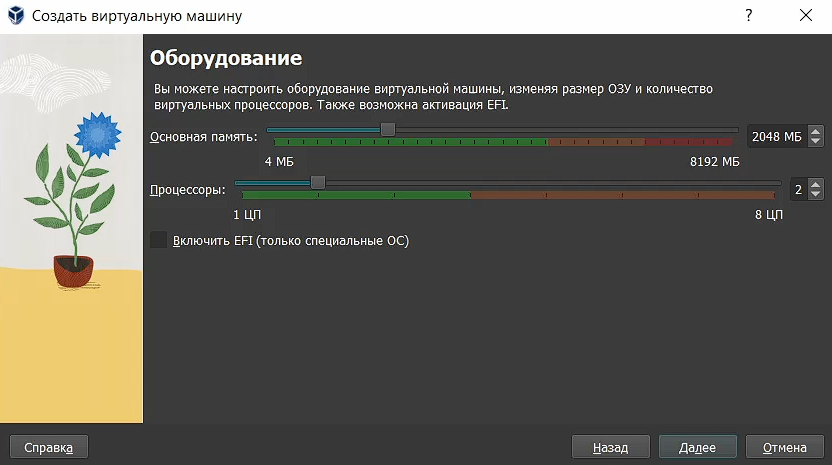
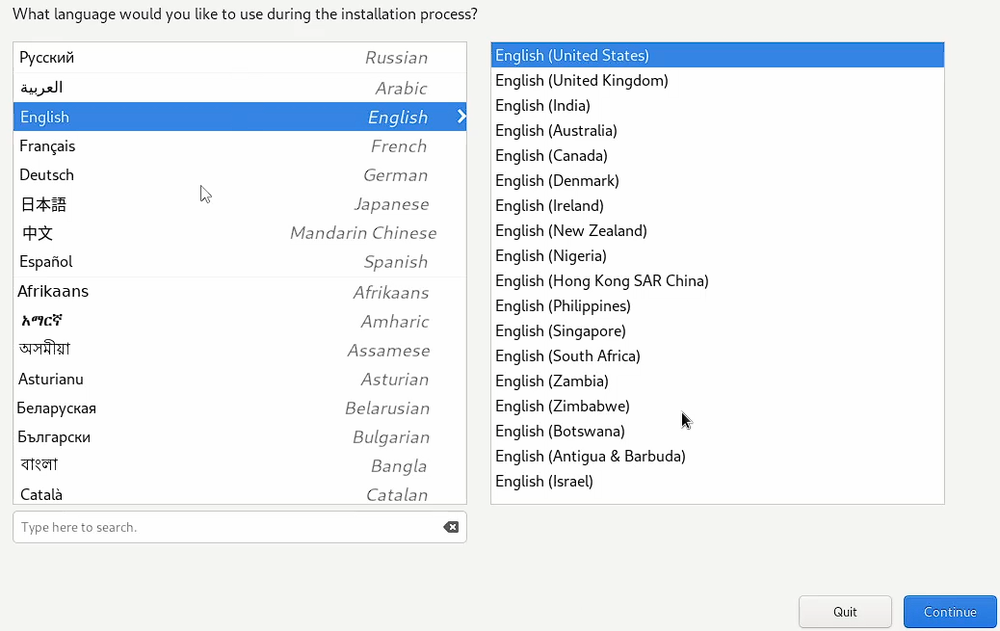
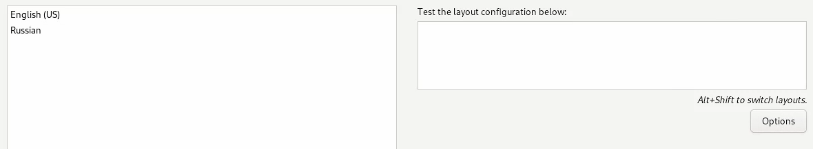
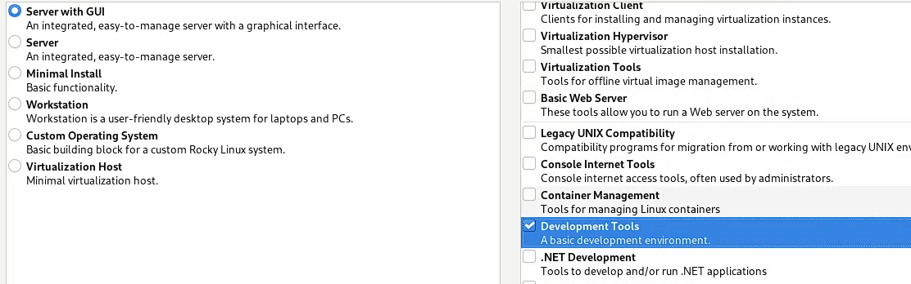
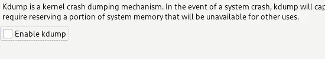
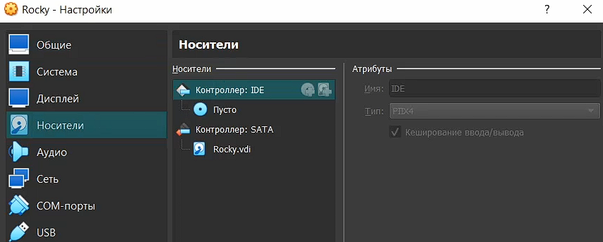
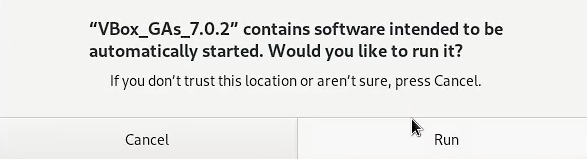

---
## Front matter
lang: ru-RU
title: Информационная безопасность
subtitle: Лабораторная работа №1
author:
  - Миронов Д. А.
institute:
  - Российский университет дружбы народов, Москва, Россия
date: 05 сентября 2024

## i18n babel
babel-lang: russian
babel-otherlangs: english

## Formatting pdf
toc: false
toc-title: Содержание
slide_level: 2
aspectratio: 169
section-titles: true
theme: metropolis
header-includes:
 - \metroset{progressbar=frametitle,sectionpage=progressbar,numbering=fraction}
 - '\makeatletter'
 - '\beamer@ignorenonframefalse'
 - '\makeatother'

## Pandoc-crossref LaTeX customization
figureTitle: "Рис."
---

# Информация

## Докладчик

:::::::::::::: {.columns align=center}
::: {.column width="70%"}

  * Миронов Дмитрий Андреевич
  * студент 4-го курса
  * группа НПИбд-02-21
  * Российский университет дружбы народов
  * [1032211701@pfur.ru](mailto:1032212279@pfur.ru)

:::
::: {.column width="30%"}

:::
::::::::::::::

# Цель работы

- Целью данной работы является приобретение практических навыков установки операционной системы на виртуальную машину, настройки минимально необходимых для дальнейшей работы сервисов.

# Выполнение лабораторной работы

## 1. Начала создания виртуальной машины

Создайте новую виртуальную машину. Укажите имя виртуальной машины, тип операционной системы — Linux, RedHat.

## 2. Размер основной памяти

Укажите размер основной памяти виртуальной машины — 2048 МБ и количество виртуальных процессоро (рис. [-@fig:002]).

{#fig:002 width=70%}

## 3. Размер диска

Задайте размер диска — 40 ГБ (или больше)

## 4. Первый запуск

Запустите виртуальную машину, выберите English в качестве языка интерфейса (рис. [-@fig:005]).

{#fig:005 width=70%}

## 5. Дополнительные настройки

При необходимости скорректируйте часовой пояс, раскладку клавиатуры; задать комбинацию клавиш для переключения между раскладками клавиатуры (рис. [-@fig:006]).

{#fig:006 width=70%}

## 6. Выбор программ

В разделе выбора программ укажите в качестве базового окружения Server with GUI , а в качестве дополнения — Development Tools (рис. [-@fig:007]).

{#fig:007 width=70%}

## 7. KDUMP

Отключите KDUMP (рис. [-@fig:008]).

{#fig:008 width=70%}

## 8. Имя узла

Включите сетевое соединение, укажите имя своего пользователя в соответствии с соглашением об именовании.

## 9. Удаление носителя

Отключить носитель информации с образом, выбрав Свойства Носители Rocky-версия-dvd1.iso Удалить устройство (рис. [-@fig:012]).

{#fig:012 width=70%}

## 10. Образ диска

В меню Устройства виртуальной машины подключите образ диска дополнений гостевой ОС (рис. [-@fig:013]).

{#fig:013 width=70%}

# Домашнее задание

1. Версия ядра Linux (Linux version).

Ответ: 5.14.0-427.33.1.el9_4.x86_64

2. Частота процессора (Detected Mhz processor).

Ответ: не вывел по какой-то причине.

3. Модель процессора (CPU0).

Ответ: AMD Ryzen 3 4300U with Radeon Graphics

## Продолжение

4. Объем доступной оперативной памяти (Memory available).

Ответ: свободно – 3659, занято – 1258 (в мб)

5. Тип обнаруженного гипервизора (Hypervisor detected).

Ответ: KVM

6. Тип файловой системы корневого раздела.

Ответ: xfs

7. Последовательность монтирования файловых систем.

# Выводы

В ходе данной лабораторной работы мы приобрели практические навыки установки операционной системы на виртуальную машину, настроили минимально необходимые для дальнейшей работы сервисы.