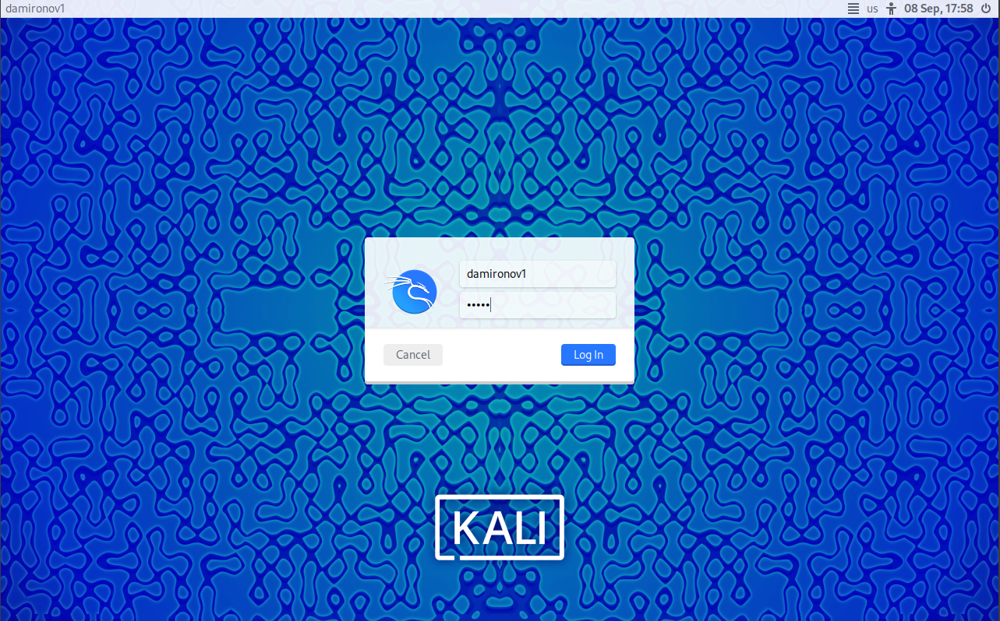

---
## Front matter
title: "Информационная безопасность"
subtitle: "Индивидуальный проект этап №1"
author: "Миронов Дмитрий Андреевич (НПИбд-02-21)"

## Generic otions
lang: ru-RU
toc-title: "Содержание"

## Bibliography
bibliography: bib/cite.bib
csl: pandoc/csl/gost-r-7-0-5-2008-numeric.csl

## Pdf output format
toc: true # Table of contents
toc-depth: 2
lof: true # List of figures
lot: true # List of tables
fontsize: 12pt
linestretch: 1.5
papersize: a4
documentclass: scrreprt
## I18n polyglossia
polyglossia-lang:
  name: russian
  options:
	- spelling=modern
	- babelshorthands=true
polyglossia-otherlangs:
  name: english
## I18n babel
babel-lang: russian
babel-otherlangs: english
## Fonts
mainfont: IBM Plex Serif
romanfont: IBM Plex Serif
sansfont: IBM Plex Sans
monofont: IBM Plex Mono
mathfont: STIX Two Math
mainfontoptions: Ligatures=Common,Ligatures=TeX,Scale=0.94
romanfontoptions: Ligatures=Common,Ligatures=TeX,Scale=0.94
sansfontoptions: Ligatures=Common,Ligatures=TeX,Scale=MatchLowercase,Scale=0.94
monofontoptions: Scale=MatchLowercase,Scale=0.94,FakeStretch=0.9
mathfontoptions:
## Biblatex
biblatex: true
biblio-style: "gost-numeric"
biblatexoptions:
  - parentracker=true
  - backend=biber
  - hyperref=auto
  - language=auto
  - autolang=other*
  - citestyle=gost-numeric
## Pandoc-crossref LaTeX customization
figureTitle: "Рис."
tableTitle: "Таблица"
listingTitle: "Листинг"
lofTitle: "Список иллюстраций"
lotTitle: "Список таблиц"
lolTitle: "Листинги"
## Misc options
indent: true
header-includes:
  - \usepackage{indentfirst}
  - \usepackage{float} # keep figures where there are in the text
  - \floatplacement{figure}{H} # keep figures where there are in the text
---

# Цель работы

Целью данной работы является приобретение практических навыков установки операционной системы на виртуальную машину, настройки минимально необходимых для дальнейшей работы сервисов.

# Ход работы

1. Создайте новую виртуальную машину. Укажите имя виртуальной машины, тип операционной системы — Linux, Debian.

2. Укажите размер опертавной памяти виртуальной машины — 16384 МБ (или большее число, кратное 1024 МБ, если позволяют технические характеристики вашего компьютера) и количество виртуальных процессоров (рис. [-@fig:001]).

{#fig:001 width=100%}

3. Задайте размер диска — 25 ГБ (или больше) (рис. [-@fig:002]).

{#fig:002 width=100%}

4. Создайте виртуальную машину.

5. Запустите виртуальную машину, выберите English в качестве языка интерфейса и перейдите к настройкам установки операционной системы,затем перезапустите виртуальную машину и зайдите с логином и паролем в созданного пользователя (рис. [-@fig:003]).

{#fig:003 width=100%}

6. При необходимости скорректируйте часовой пояс, раскладку клавиатуры, рекомендуется добавить русский язык, но в качестве языка по умолчанию указать английский язык; задать комбинацию клавиш для переключения между раскладками клавиатуры.
7.  В итоге вы попадаете на рабочий стол Kali Linux (рис. [-@fig:004] и [-@fig:005] )

{#fig:004 width=100%}

{#fig:005 width=100%}

# Список литературы{.unnumbered}

::: {#refs}
:::
