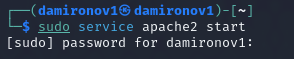

---
## Front matter
lang: ru-RU
title: Информационная безопасность
subtitle: Индивидуальный проект этап №2
author:
  - Миронов Д. А.
institute:
  - Российский университет дружбы народов, Москва, Россия

## i18n babel
babel-lang: russian
babel-otherlangs: english

## Formatting pdf
toc: false
toc-title: Содержание
slide_level: 2
aspectratio: 169
section-titles: true
theme: metropolis
header-includes:
 - \metroset{progressbar=frametitle,sectionpage=progressbar,numbering=fraction}
 - '\makeatletter'
 - '\beamer@ignorenonframefalse'
 - '\makeatother'

## Pandoc-crossref LaTeX customization
figureTitle: "Рис."
---

# Информация

## Докладчик

:::::::::::::: {.columns align=center}
::: {.column width="70%"}

  * Миронов Дмитрий Андреевич
  * студент 4-го курса
  * группа НПИбд-02-21
  * Российский университет дружбы народов
  * [1032211701@pfur.ru](mailto:1032212279@pfur.ru)

:::
::: {.column width="30%"}

:::
::::::::::::::

# Цель работы

- Целью данной работы является установка DVWA в гостевую систему к Kali Linux.

# Выполнение 2 этапа проекта

## 1. Запустите виртуальную машину

Запуск виртуальной машины(рис. [-@fig:001]).

{#fig:001 width=70%}

## 2. Откройте терминал

Откройте терминал (рис. [-@fig:002])

{#fig:002 width=70% height=80%}

## 3. Переход в папку /var/www/html

Перейдите в папку /var/www/html и от имени администратора отклонируйте репозиторий git hub (рис. [-@fig:003]).

{#fig:003 width=70%}

## 4. Необходимая настройка

Измените права доступа к папке установки, перейдите к файлу конфигурации в каталоге установки,скопируйте файл конфигурации и переименуйте его, oткройте файл настроек и измените пароль на что-то более простое для ввода(рис. [-@fig:004]).

{#fig:004 width=70%}

## 5. Установка mariadb

Установите mariadb (рис. [-@fig:005])
 
{#fig:005 width=70%}

## 6. Запуск базы данных

Запустите базу данных (рис. [-@fig:006])

{#fig:006 width=70%}

## 7. Вход в базу данных

Войдите в базу данных (рис. [-@fig:007])

{#fig:007 width=70%}

## 8. Создание пользователя базы данных

Создайте пользователя базы данных. Нужно использовать те же имя пользователя и пароль, которые использовались в файле конфигурации (рис. [-@fig:008])

{#fig:008 width=70%}

## 9. Открытие для редактирования файл php.ini

Откройте для редактирования файл php.ini, чтобы включить следующие параметры: allow_url_fopen и allow_url_include:(рис. [-@fig:009])

{#fig:009 width=70%}

## 10. Запуск сервера Apache

Запустите сервер Apache

{#fig:0010 width=70%}

## 11. Открытие DVWA в браузере для проверки работы сервера

Откройте DVWA в браузере для проверки работы сервера 

{#fig:0011 width=70%}

# Выводы

В ходе данной 2 этапа проекта мы приобрели практические навыки установки DWVA на виртуальную машину, настроили необходимые для дальнейшей работы .