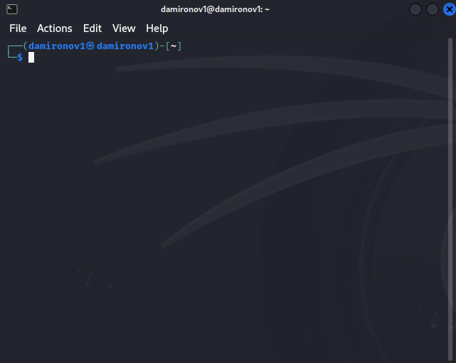
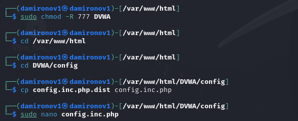
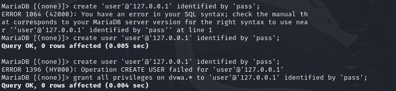
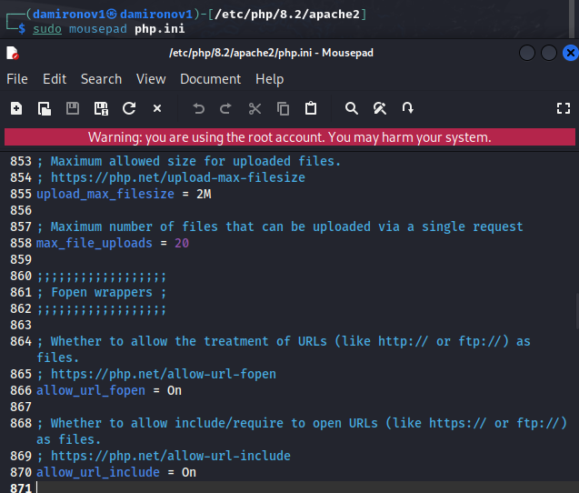
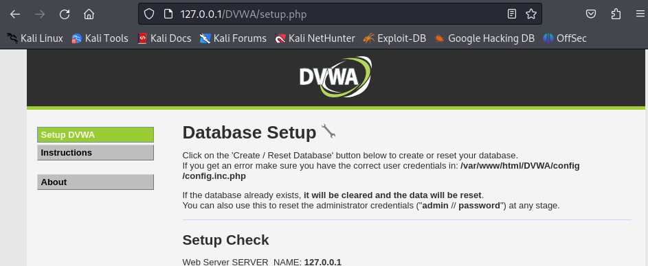

---
## Front matter
title: "Информационная безопасность"
subtitle: "Индивидуальный проект этап №2"
author: "Миронов Дмитрий Андреевич (НПИбд-02-21)"

## Generic otions
lang: ru-RU
toc-title: "Содержание"

## Bibliography
bibliography: bib/cite.bib
csl: pandoc/csl/gost-r-7-0-5-2008-numeric.csl

## Pdf output format
toc: true # Table of contents
toc-depth: 2
lof: true # List of figures
lot: true # List of tables
fontsize: 12pt
linestretch: 1.5
papersize: a4
documentclass: scrreprt
## I18n polyglossia
polyglossia-lang:
  name: russian
  options:
	- spelling=modern
	- babelshorthands=true
polyglossia-otherlangs:
  name: english
## I18n babel
babel-lang: russian
babel-otherlangs: english
## Fonts
mainfont: IBM Plex Serif
romanfont: IBM Plex Serif
sansfont: IBM Plex Sans
monofont: IBM Plex Mono
mathfont: STIX Two Math
mainfontoptions: Ligatures=Common,Ligatures=TeX,Scale=0.94
romanfontoptions: Ligatures=Common,Ligatures=TeX,Scale=0.94
sansfontoptions: Ligatures=Common,Ligatures=TeX,Scale=MatchLowercase,Scale=0.94
monofontoptions: Scale=MatchLowercase,Scale=0.94,FakeStretch=0.9
mathfontoptions:
## Biblatex
biblatex: true
biblio-style: "gost-numeric"
biblatexoptions:
  - parentracker=true
  - backend=biber
  - hyperref=auto
  - language=auto
  - autolang=other*
  - citestyle=gost-numeric
## Pandoc-crossref LaTeX customization
figureTitle: "Рис."
tableTitle: "Таблица"
listingTitle: "Листинг"
lofTitle: "Список иллюстраций"
lotTitle: "Список таблиц"
lolTitle: "Листинги"
## Misc options
indent: true
header-includes:
  - \usepackage{indentfirst}
  - \usepackage{float} # keep figures where there are in the text
  - \floatplacement{figure}{H} # keep figures where there are in the text
---

# Цель работы

Целью данной работы является установка DVWA в гостевую систему к Kali Linux.

# Ход работы

1. Запустите виртуальную машину (рис. [-@fig:001]).

{#fig:001 width=100%}

2. Откройте терминал (рис. [-@fig:002]).

{#fig:002 width=100%}

3. перейдите в папку /var/www/html и от имени администратора отклонируйте репозиторий git hub (рис. [-@fig:003]).

{#fig:003 width=100%}

4. Измените права доступа к папке установки, перейдите к файлу конфигурации в каталоге установки,скопируйте файл конфигурации и переименуйте его, oткройте файл настроек и измените пароль на что-то более простое для ввода(рис. [-fig:004]).

{#fig:004 width=100%}

5. Установите mariadb (рис. [-@fig:005])

{#fig:005 width=100%}

6. Запустите базу данных (рис. [-@fig:006])

{#fig:006 width=100%}

7. Войдите в базу данных (рис. [-@fig:007])

{#fig:007 width=100%}

8. Создайте пользователя базы данных. Нужно использовать те же имя пользователя и пароль, которые использовались в файле конфигурации (рис. [-@fig:008])

{#fig:008 width=100%}

9. Откройте для редактирования файл php.ini, чтобы включить следующие параметры: allow_url_fopen и allow_url_include:(рис. [-@fig:009])

{#fig:009 width=100%}

10. Запустите сервер Apache(рис. [-@fig:010])

{#fig:010 width=100%}

11. Откройте DVWA в браузере для проверки работы сервера (рис. [-@fig:011])

{#fig:011 width=100%}

# Список литературы{.unnumbered}

::: {#refs}
:::
